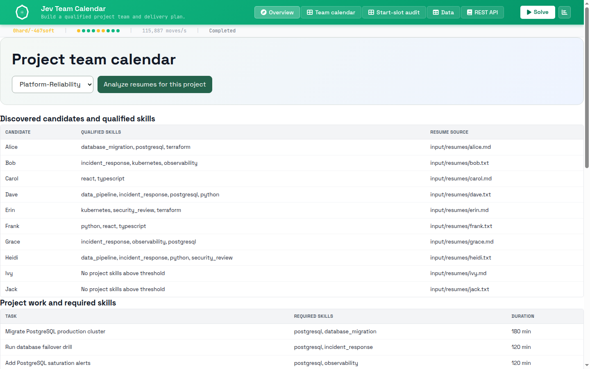
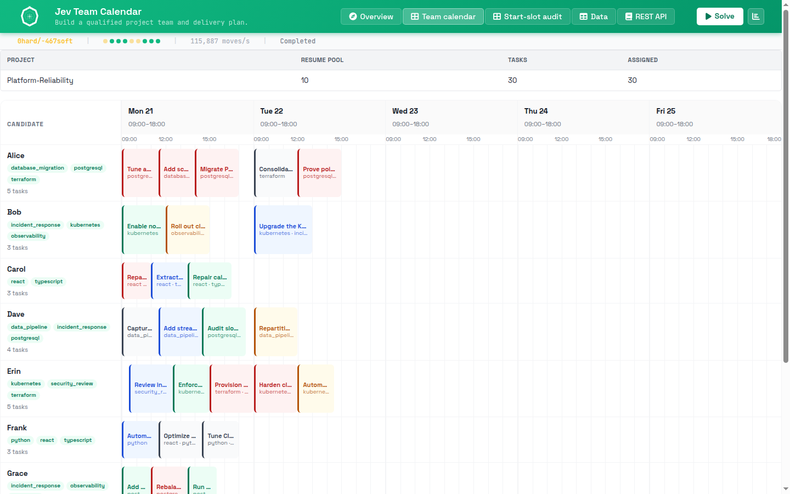
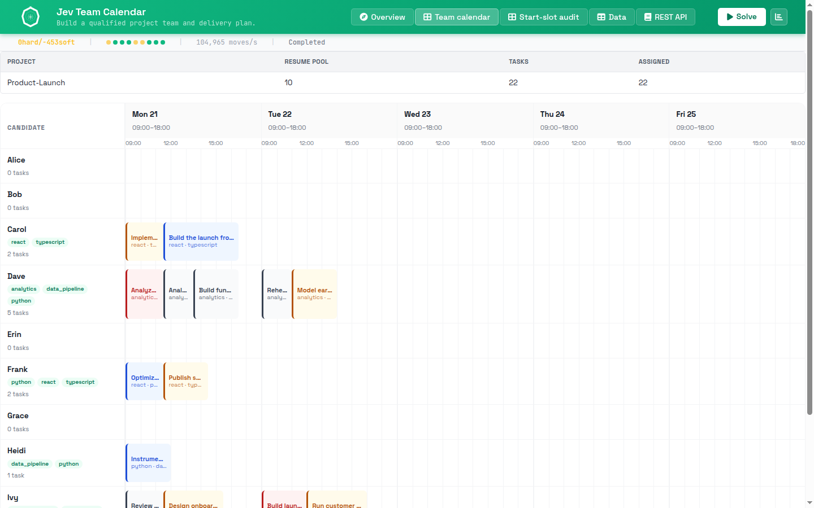

# Jev Team Calendar

<div align="center">

Turn a folder of resumes into a qualified, scheduled project team.

[](https://github.com/blackopsrepl/jev-team-calendar/actions/workflows/ci.yml)
[](https://www.rust-lang.org)
[](https://crates.io/crates/solverforge)
[](LICENSE)

</div>

Jev Team Calendar is a local web application that reads a shared pool of resumes,
works out who is qualified for the project you selected, and schedules the work
across the week. There is no employee roster to maintain and no skill matrix to
keep up to date: the people, their skills, and their availability all come from
the resumes.

You choose a project and press **Solve**. The app does the rest.

## What it looks like

The overview shows the employees discovered from the resume pool, the skills each
one was credited with, and the work that needs doing.



The team calendar places every task on the right weekday at the right time, one
row per person. Monday is packed first, then Tuesday, and so on.



Each project has its own skill universe, so the same resume pool produces a
different team. Product launch needs designers, analysts, and copywriters rather
than database and Kubernetes engineers.



## How it works

```text
input/resumes/*  +  input/projects/<project>/tasks.json
                              |
                              v
                 Jev reads each resume once
                 (one call per resume, before solving)
                              |
                              v
          generated/projects/<project>/jev_candidates.json
                              |
                              v
            SolverForge assigns people and times
                              |
                              v
                     team calendar
```

Two systems do two clearly separated jobs:

1. **Jev reads resumes.** For the selected project it estimates, for every
   resume and every skill that project needs, whether the person has real
   production evidence of that skill. Nothing is assigned at this stage.
2. **SolverForge plans the week.** It takes the qualified people and the task
   list and decides who does what, and when — respecting skills, working hours,
   availability, and the fact that one person cannot be in two places at once.

Jev never assigns work, never picks a time, and is never called while the solver
is running.

## Quick start

You need the [SolverForge CLI](https://github.com/solverforge/solverforge-cli)
and a TypeSafe API key.

```bash
# 1. Put your key where the app can read it (this file is git-ignored).
echo 'TYPESAFE_API_KEY=your_key_here' > .env

# 2. Start the app.
solverforge server
```

Open <http://127.0.0.1:7860>, then:

1. Pick a project from the dropdown.
2. Press **Analyze resumes for this project** and wait for Jev to finish reading.
3. Press **Solve**.

The app manages its own Python environment with `uv`; you do not need to create
or activate a virtual environment. `uv` downloads the TypeSafe SDK the first
time you analyze resumes.

> Use `solverforge server --port 7871` if port 7860 is already taken.

## Add your own data

- **Resumes** go in `input/resumes/`. `.md`, `.txt`, and `.pdf` are supported.
  Each file becomes one candidate, named after the file.
- **Projects** live in `input/projects/<project>/tasks.json`. A task lists its
  required skills, how long it takes, and the window it may run in.

The skill universe for a project is simply the set of skills its tasks require,
so adding a task with a new skill automatically makes Jev look for that skill in
every resume.

## Built-in demo projects

| Project | Tasks | Focus |
|---------|-------|-------|
| `platform-reliability` | 30 | PostgreSQL, Kubernetes, Terraform, security, data pipelines |
| `product-launch` | 22 | Design, frontend, analytics, growth, copywriting |

Both ship with 10 sample resumes and deterministic cached Jev results, so you can
run the app and press **Solve** immediately without spending API calls.

## Rules the scheduler enforces

Every one of these is a hard rule; the solver will not return a plan that breaks
one.

- every task gets an assignee and a start time;
- the assignee has every skill the task requires;
- nobody is double-booked;
- a task fits its window and a single working day;
- a task only runs when the assignee is available.

On top of that it prefers to finish the work as early as possible, to avoid idle
gaps in someone's day, and to keep the workload fair.

## Configuration

| Setting | Where | Default |
|---------|-------|---------|
| Server port | `solverforge server --port N` | `7860` |
| Skill match threshold | `JEV_SKILL_THRESHOLD` | `0.80` |
| TypeSafe API key | `.env` or the environment | — |
| Work week | `src/data/app_data.rs` | Mon–Fri, 09:00–18:00, 30-minute slots |

## Development

```bash
make check     # solverforge check + cargo check
make test      # solverforge test + uv run pytest
make run       # solverforge server
```

See [RELEASE.md](RELEASE.md) for the release process and
[the API guide](http://127.0.0.1:7860) once the app is running for the full
HTTP surface. The web shell also exposes a **REST API** tab documenting every
endpoint.

### Repository layout

```text
src/domain/        Candidate fact, Task entity, Plan solution
src/constraints/   Six hard and three soft constraints
src/data/          Project catalog and cached-fact loading
src/api/           Ingest route, job lifecycle, DTOs, SSE, telemetry
tools/             TypeSafe Jev preprocessing boundary and Python tests
static/            Application UI on the shipped solverforge-ui shell
input/             Resumes and per-project task definitions
docs/images/       Screenshots used in this README
```

## Publishing

The project publishes to two remotes: the local Forgejo
(`origin`) and GitHub (`github`). CI runs formatting, Clippy, tests, and the
browser script check on both. Pushing a `v*` tag creates the release on each.
See [RELEASE.md](RELEASE.md).

## License

Apache License 2.0. See [LICENSE](LICENSE).
